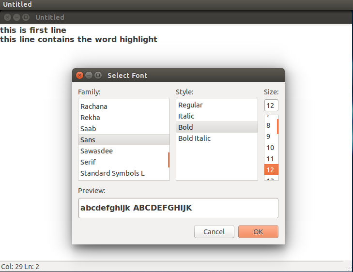

This article describes my experience in making a minimal GUI based text editor using C and GTK+2. It took me roughly seven days working 1-2 hours per day to make the entire thing up and running. This project was actually an assignment of one my my 5th semester subject **System Software**. 

## Requirements 

Following were the requirements that needed to be satisfied by the Text Editor to be acccountable for credits. 
  
  * It should be GUI based.
  * It should be programmed using C.
  * It should at least provide basic features for creating and saving a file.

## Deadline 

I had **1 week** time to complete the project. 

## Background

I had an experience of making a GUI program few years back, but it was done using Microsoft Visual Basic. The sole purpose of Visual Basic,as its name implies, is to make visually appealing GUI software with ease. In fact, a simple text editor such as one required here could me made within 30 minutes in Visual Basic.

Here, I had to implement the software in C which is like the lowest level of programming (not technically though). I was fairly comfortable with the syntax and semantics of C and working with tools like Lex and YACC recently had boosted my confidence in working with C. However, my exposure to C had been limited to console programs only so I had absolutely no idea how to make graphical application using C. 

## Research

Due to my background in GUI using C being limited, I had to search and select suitable tool and experiment with it before making the actual text editor.So,the search for the tool began.

After some googling, I found **GTK** to be one of the most popular tool for making GUI programs and C was one of the many languages which GTK had provided API to work with. I decided to give it a try.I opened their official page and after a while I came across easy to follow [tutorial](http://zetcode.com/gui/gtk2) from Zetcode. 

## Planning
I played with GTK for a while following Zetcode's tutorial. Their tutorial showed the usage of common elements provided by GTK.I started experimenting with GTK widgets.This went on for some hours until I came to my sense. I came to conclusion that this approach was good in terms of experimenting with the tool, but was highly inefficient in terms of time. The solution to this problem turned out to be actual *starting point* in the process of making the software.

Due to time limitation, I decided to play with tools that are just required for the text editor.To determine this , I drew the basic layout of  of the text editor that I had in my mind. Then i started figuring out the widgets that's required to make the tool. 

To figure out the widgets,I manually(could have made a script if time was not a factor) listed down the list of tools for which the tutorial were provided. Then,  i started marking the tools required and only followed the tutorials for the required widgets.

I decided to name the program **sedit** which stands for simple edit. 

## Development

I divided the development of the actual program into four phases. Each phase involved completing certain feature which was accomplished after playing with the tool and implementing it immediately in the text editor.Along with the Zetcode's Tutorial, I frequently referred to [official documentation](https://developer.gnome.org/gtk2/stable/) to get clear picture of underlying code. 

##### Phase I

The first phase had to do with the look and feel of the program. It involved putting each and every element and gluing them together into a large picture that makes sense. 

After this phase was over, I got a picture of how real world GUI applications are made by laying out each elements one by one. In this phase along with the menu items, I implemented Status bar as well . Status bar displays the the position of cursor in the text editor.

##### Phase II

The second phase was the longest phase. It mainly consisted of programming. In this phase, I worked with area where actual text editing took place, *textviewer*. 

I was fortunate in finding [this](http://www.bravegnu.org/gtktext/gtktext-0.4.html) tutorial which explained text editing widgets clearly and concisely. In this phase, I got to experience the main element of text editor, buffer, and play with the buffer using things such as iterator and mark. Also, the features such as Copy, Cut, and paste were implemented in this phase.

##### Phase III

This phase involved playing with additional tools and widgets. I completed the About dialog and options menu in this phase. Options menu provided options for configuring the font and searching a text. Implementing the search feature was interesting as it involved further working with the text buffer and iterator. 

##### Phase IV

This final phase was a wind up session where remaining features such as opening and saving a file was completed and some testing was performed. Being a minimal software, testing was not so challenging. The final touch was given to the code structure and main look before the first fully featured editor was compiled. 

## Conclusion
Creating a text editor from scratch was an enlightning experience. The main element of concern was the time limit which made the project more challenging and interesting. 

I got to see a picture of how large programs such as GTK are made using C. Mainly, it showed me how object oriented pattern was implemented using C in making of GTK. Now, I think I will be more comfortable if I were to explore large C projects such as Linux Kernel.

Another aspect of programming I encountered had to do with the size of project. See a program grow from 1 line to hundreds of lines within a short span of time bought new dimension of challenge in the code. It had to do with the structure of the code. I had to structure it considering two things in mind: readability of code and ease of addition of new features. 

The most important thing i learnt had to do with approach of making a software. I used the following approach  here: learning and making program parallelly. This approach turned out to be effective and I intend to use it again  and again. 

## Source Code
I have open sourced the project in github. You can look at the source and play with it to see how the software is made. Comments are used in the source code which makes it more readable.I highly encourage you to open the official documentation alongside and play with the code. 

[ Github link ](https://github.com/incessantmeraki/sedit)

## References 
* [GTK+ tutorial](http://zetcode.com/gui/gtk2/)
* [GTK+2 Reference Manual](https://developer.gnome.org/gtk2/stable/)
* [Multiline Text Editing Widget](http://www.bravegnu.org/gtktext/gtktext-0.4.html)
